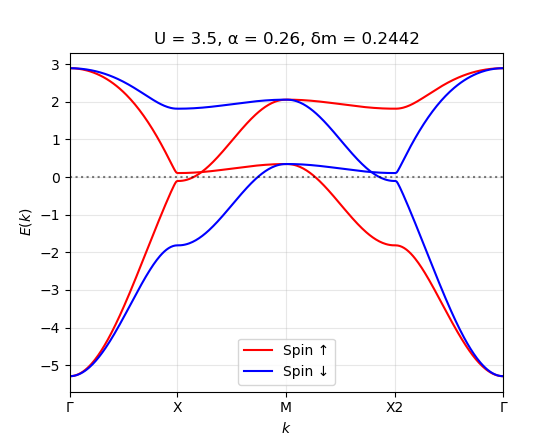

# **Altermagnetic Hubbard Model**  
### *Julia Package for Simulating Altermagnetic Systems*  

[](LICENSE)  
[](https://julialang.org/)  
<!-- [](https://doi.org/XXXXXX) *(optional)*  -->

---

## **📌 Overview**  
This Julia package provides tools for studying the **Altermagnetic Hubbard Model**, including:  
- Self-consistent mean-field calculations  
- Band structure and Fermi surface visualization  
- Spectral functions and conductivity tensors  
- Lattice geometry construction  

---

## **🚀 Installation**  
1. **Julia Requirement**: Ensure Julia `v1.9+` is installed.  
2. **Add the Package**:  
   ```julia
   julia> ]  # Enter Pkg mode
   pkg> add https://github.com/javahedi/AltermagnetHubbardModel.git
   ```
3. **Load the Package**:  
   ```julia
   using AltermagnetHubbardModel
   ```

---

## **📂 Project Structure**  
```plaintext
.
├── src/                     # Source code
│   ├── ModelParameters.jl   # Parameters (U, t, μ, etc.)
│   ├── LatticeGeometry.jl   # Lattice construction
│   ├── SelfConsistentLoop.jl # Mean-field solver
│   └── ...                  
├── examples/               # Tutorial scripts
├── test/                   # Unit tests
└── docs/                   # Documentation (optional)
```

---

## **🎯 Features**  
### **1. Band Structure & Fermi Surface**  
```julia
bands = compute_bands(parameters)
plot_fermi_surface(bands)
```
 *(replace with actual image)*  

### **2. Self-Consistent Mean-Field Solution**  
```julia
result = solve_scf!(parameters; maxiter=1000)
```

### **3. Conductivity Tensor Calculation**  
```julia
σ = compute_conductivity(parameters, ω=0.0)
```

---

## **📚 Examples**  
See [`examples/main.jl`](examples/main.jl) for a workflow:  
```julia
include("examples/main.jl")
```


---

## **🤝 Contributing**  
Contributions are welcome!  
1. Fork the repository  
2. Open a PR with your changes  

---

## **📄 License**  
MIT License. See [LICENSE](LICENSE).  


